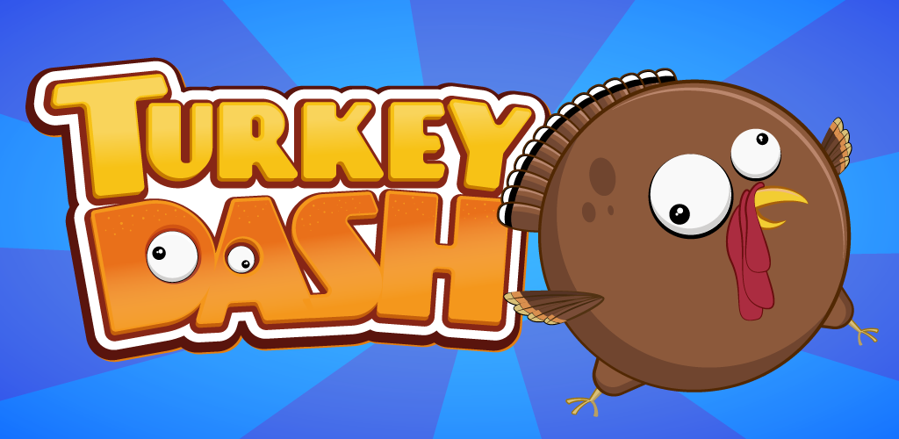
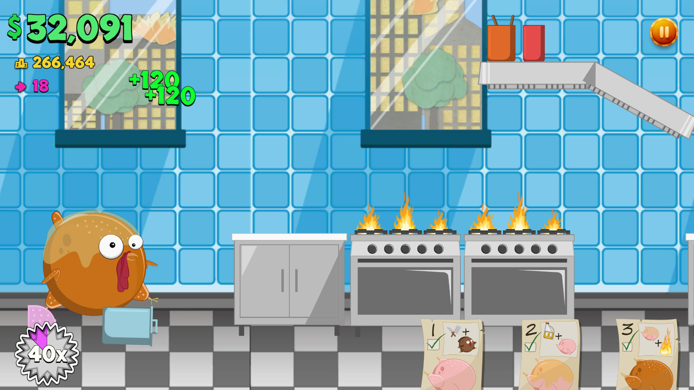
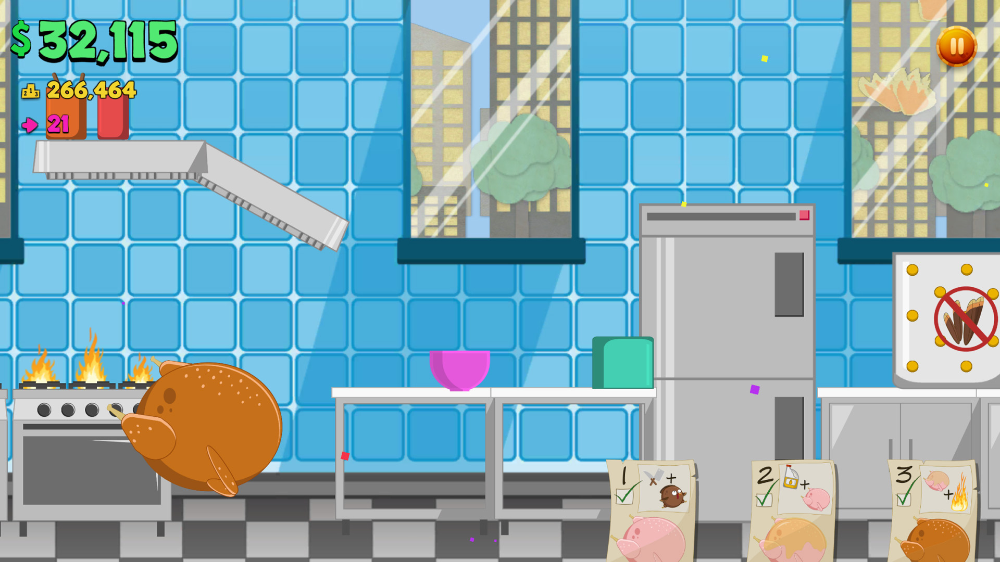
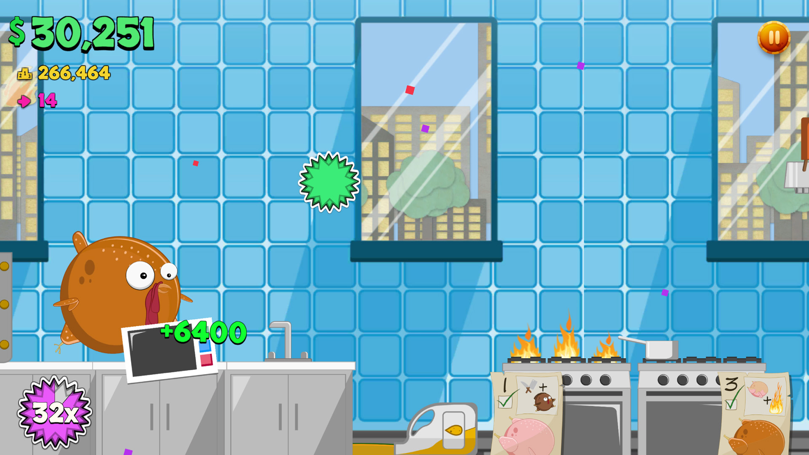

# Turkey Dash

**Platform:** iOS & Android  
**Engine:** Unity (2D)  
**Studio:** Red Kraken Apps, LLC  
**Released:** 2017  
**Built by:** One person, in about seven weeks

---

---

---

## What It Is

A fat, terrified turkey is loose in a commercial kitchen. Your job is to cause as much property damage as possible before time runs out -- then move to the next stage and do it again.

The twist: there's a way to lose that isn't just "time ran out." Get defeathered. Get covered in oil. Touch fire. In that order. **You're dinner.**

Three stages shipped: kitchen, pantry, dining hall. Original art throughout. Silly sound effects. A breakable object physics system built from scratch. A game over screen that says *You're Dinner!* and means it.

---

## The Mechanic

Most mobile games punish you for hitting things. This one rewards it -- up to a point.

The scoring loop is property damage: break things, collect the dollar value, chain multipliers. The risk is the status sequence. Defeathered → oiled → fire means you're cooked. Literally. So you're simultaneously trying to maximize chaos while managing your own vulnerability state. It's a small idea that creates genuinely interesting tension for a game this simple.

---

## How It Got Built

Solo. Everything -- design, code, art, UI, sfx integration, monetization, App Store submission. Concept to launch in under two months.

This was the project where the lessons from Catasaurus Rex and Dungeon Construction Co. paid off. The engine was familiar. The pipeline was faster. The scope was tighter by design. Three stages, one character, one clear mechanic. No scope creep, no committee.

The art style shifted from the outsourced illustration look of Catasaurus Rex to something I could own entirely -- clean vector shapes, expressive character animation, consistent kitchen environment. It's a smaller game but a more coherent one.

---

## What I Learned

- Constraint is a design tool. One character, one environment, one mechanic -- the game is better for it
- A clever game over condition is worth more than a dozen power-ups. Players remember the rules that surprise them
- Solo development at speed requires ruthless scope decisions made early -- the pantry and dining hall almost didn't ship; cutting a fourth stage made the other three better
- Dark humor is a legitimate design voice. Not every game has to be aspirational. Sometimes the bit is the point

---

## Status

No longer live. It had a small following while it ran. Given unlimited time and a marketing budget it could have been considerably more -- the core loop had legs. The source lives here.

---

*Built with Unity. All art original. © 2017 Red Kraken Apps, LLC.*
